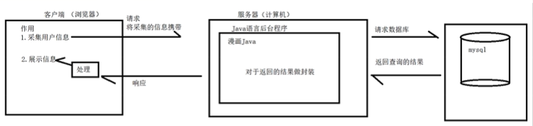
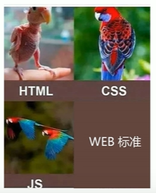

# VSCode 常用快捷键

##### 1.快速复制一行

-    光标移到目标行，按住 shift+alt，再按向下/上箭头以复制一行

##### 2.选中多个相同单词

-    双击目标单词，按住 ctrl+d，按 d 以继续选择下一项

##### 3.添加多个光标

-    光标移到目标行，按住 ctrl+alt，再按向下/上箭头以在下一行添加光标

##### 4. 查找/替换

-    按 ctrl+h

##### 5. 跳转到指定行

-    按 ctrl+g

##### 6.界面缩放

-    按 ctrl+ +/-

##### 7.保存全部

-    先按 ctrl+k，再按 s

# Git 提交

```cmd
$ git add .
$ git commit -m "描述"
$ git push origin master
```

# Web 模型(前端/后台/数据库间的关系)



# Web 标准

##### 1.结构（HTML）

-    用于网页元素整理分类

##### 2.表现（CSS）

-    用于网页元素外观

##### 3.行为（JS）

-    用于网页交互

##### 4.神图



# HTML 语法

##### 标签

1.双标签

```html
<html></html>
```

2.标签嵌套

```html
<html>
     <title></title>
</html>
```

3.标签并列

```html
<head></head>
<body></body>
```

4.字符集

```html
<meta charset="UTF-8" />
```

# HTML 基本结构标签

```html
<html>
     <head>
          <title>页面</title>
     </head>
     <body>
          程序员烧烤
     </body>
</html>
```

# HTML 常用标签

##### 1.标题标签(h1-h6)

```html
<h1>一级标题</h1>
```

##### 2.段落标签(p)

```html
<p>段落</p>
```

##### 3.换行标签(br)

```html
<p>第一行<br />第二行</p>
```

##### 4.表单标签(form)

负责数据采集功能（注册/登录）

```html
<form action="" method=""></form>
```


##### 5.表单标签-表单项标签(input / select / textarea)


##### 6.表格标签(table)


##### 7.常用标签


##### 8.文档链接

```url
https://developer.mozilla.org/zh-CN/docs/Web/HTML/
```

# CSS 知识点

##### 1.样式选择器 ( 优先级：ID > 类 > 元素 )

-    元素选择器

```html
元素名{ ... }
```

-    类选择器

```html
.类名{...}
<元素名 class=" 类名"></元素名> //为元素添加类属性
```

-    ID 选择器

```html
#ID名{...}
<元素名 id=" ID名"></元素名> //为元素添加ID属性
```

##### 2.盒子模型

###### 组成

-    内容区域 (Content)
-    内边距区域 (Padding)
-    边框区域 (Border)
-    外边框区域 (Margin)
     

###### 布局标签

```html
<div></div>
//独占一行，可设置width,height
```

```html
<span> </span> //一行可显示多个，不可设置width,height
```

##### 3.Flex 布局


##### 4.常用知识点


# JS 知识点

##### 1.外部文件引用

```html
<script src="" type="module"></script>
```

##### 2.常用知识点

-    输出语句
     ```javascript
     window.alert(); //弹出警告框
     console.log(); //输出到浏览器控制台
     ```
-    字符串拼接
     ```javascript
     `我今年${data.age}岁`;
     ```
-    函数

```javascript
//具名声明
function name(a, b) {}

//匿名声明
//1.函数表达式
let name = function (a, b) {};
//2.箭头函数
let name = (a, b) => {};
```

-    自定义对象
     ```javascript
     let className={
        name:"Steve",
        age: 20,
        gender: "male"
        method(a,b){}
     }
     ```
-    JSON 对象方法

     ```javascript
     let person = {
          name: "Steve",
          age: 20,
     };
     alert(JSON.stringify(person)); //JS对象JSON字符串化

     let personJSON = "{"name":"Steve",  "age":20}";
     alert(JSON.parse(personJSON).name); //JSON字符串JS对象化
     ```

-    文档对象模型 DOM（将 HTML 中的各组成部分封装为对象）
     

-    DOM 的获取

```javascript
//返回找到的第一个对应标签
let name = document.querySeletor("选择器类型（如#id）");

//返回找到的对应标签数组（标签名[0]）
let name = document.querySeletorAll("选择器类型（如#id）");
```

-    事件监听

```javascript
EventSource.addEventListener("EventType", () => {});
```

-    常用事件
     
     （注：焦点指光标当前位置，例如点击输入框后输入框内出现光标，则输入框获得焦点；点一下空白区域输入框失去光标，则输入框失去焦点）
